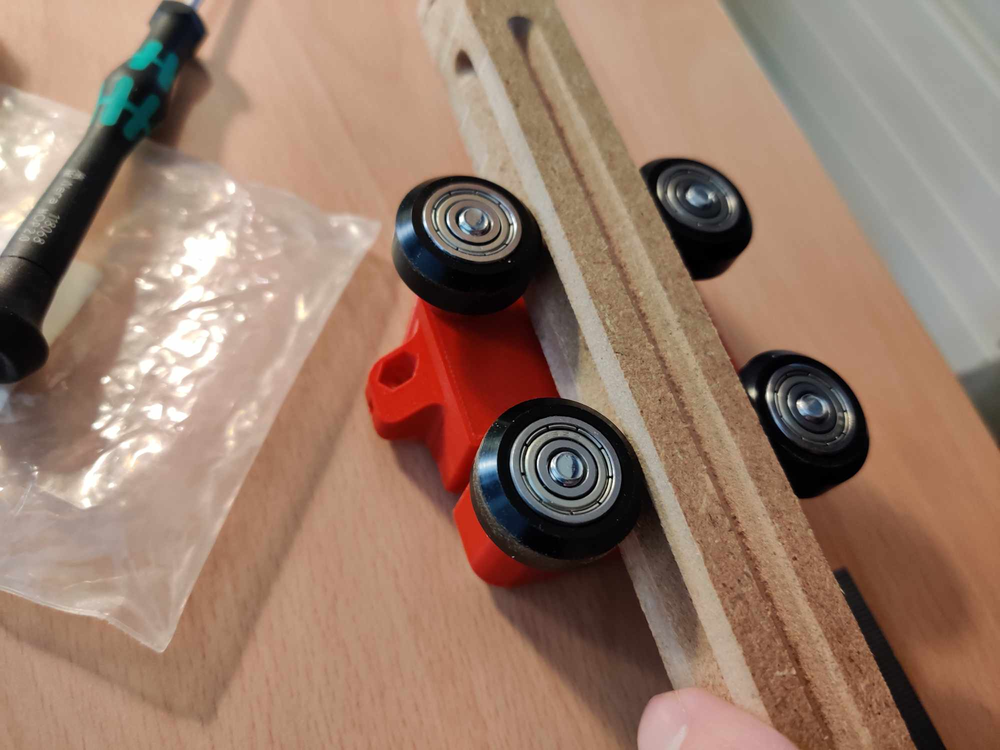

# Beehive_beam_cnc_router
Experimental repo to make Beehive beam using cnc router: [beehive project](https://gitlab.cba.mit.edu/quentinbolsee/beehive-axes/-/tree/main/parts?ref_type=heads)

## Object and concept

So far we've been printing out the beams and they have a limed to being 250mm long using Ultimaker printers at the Fab Academy instructor bootcamp there was a longer print using SainSmart INFI-20 Belt 3D Printer that Baken [documented](https://academany.fabcloud.io/fabacademy/2023/instructors-bootcamp/Projects/PrintableAxis/)
We are curious and want to attempt to make a long beam using standard cnc router with standard tools. We want to use standard commonly available material.
- use commonly available materials
- do it using 3 axis

## Proof of concept - spiral 1

Since this is only proof of concept we are using low pressure and not designing the end attachment.

- Material
  - We decided to use MDF since it's consistent and easy to work with [Valcromat](https://www.investwood.pt/en/valchromat/) might be a good alternative but not as common and more expensive.
  - Since MDF does not come in 20mm we used 19mm.
    - Alternative we could use thinker MDF and mill it down or change the Beehive design. 
- tools
  - One 6mm milling tool for the profile cut and pocket clearance
  - V-bit to make the bearings groove.
-Software
 - We used v-carve to design and setup 
- Method
  - Do a two sided job
    - Job one does the V groove, cut's the profile 19mm x 500mm and clears a 19mm x 500mm pocket.
    - Job two only does a V groove and the part from Job 1 is pressed in the groove.

## conclusion

It works and can be improved. precision can be improved by using the cnc router and surface plane the spoil board.

## Next spiral

- make it longer
- figure out end attachment solutions
   
.jpg)

We used a 0,4mm offset for a good fit.

Wedges can be used to compress the part in place. In this case the fit was good so they we're not really needed

Part failed due to tabs not being strong enough
